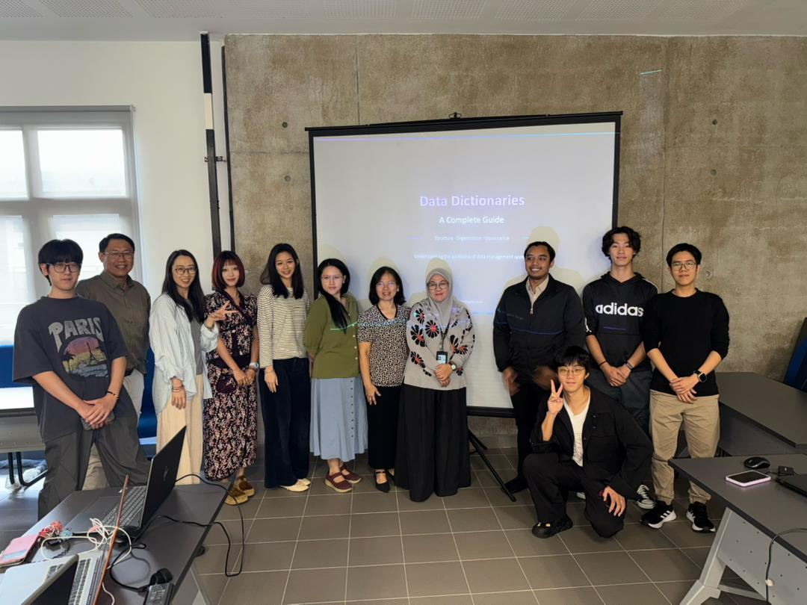

# Welcome

To the CIPTA KYUEM website! From time to time news and events will be posted here, and you can find some informational insights about the club here too! 

## What's CIPTA about?

CIPTA Society comprises of 4 niche divisions: 
1. [Robotics](./pages/robotics.md)
2. [Cybersecurity](./pages/cybersecurity.md)
3. [Data Science](./pages/data-science.md)
4. [Recreational Activities](./pages/recreational-activities.md) 

CIPTA focuses purely on hands-on type of events / workshops each semester. We allow students (outside this club’s committee) to become helpers, and our committees will be teaching them some skills before the event starts.

# Members

Who is a part of CIPTA committee list? See the roster of [members](./pages/members.md)!

# Planned/Future Workshops

| Managing Division | Workshop Name | Planned Date |
| ----------------- | ------------- | ------------ |
| Data Science | [Data Wrangling Workshop](./pages/activities-2026/data-wrangling-workshop.md) | 30th March 2026 |

> [!INFO]
> Due to recent unexpected issues, the Data Wrangling Workshop date is shifted from January to March 2026.

# Past Activities

Below are a list of our past activities!

1. [Pongal Festival Celebration](./pages/activities-2025/pongal-festival-celebration.md)
2. [Intro2Linux Workshop](./pages/activities-2025/intro2linux-workshop.md)

# Applying to CIPTA

We annually interview and select candidates that would be a great addition to our list of [members](./pages/members.md). If you're interested to become a part of our team, keep an eye out for the recruitment drive happening in January - February 2026!

# Beyond CIPTA

CIPTA helps connect students with internship opportunities!

### [Institute of Visual Informatics, UKM](https://www.instagram.com/p/DS6ur2Fj7nd/)

# Extras

The CIPTA club has published a basic info pack for students at KYUEM that want to learn more about us, you can find it at the link below:

[CIPTA KYUEM Info Pack](https://docs.google.com/presentation/d/1dRYC5ppRAR53O-mV0gRLYM5W3ton16fkjUjZhM8bqF0/edit?usp=sharing)